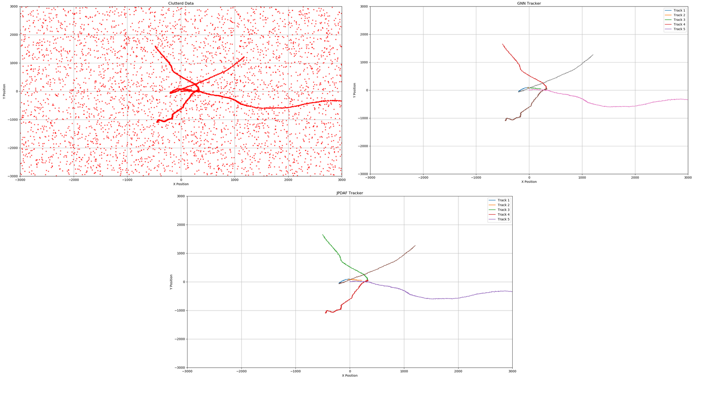

# Multi Object Tracking (MOT) In Clutter
Despite the significant progress in automated tracking of moving objects, tracking multiple objects simultaneously remains a complex task. The primary challenge in these areas is to accurately determine the status of a varying number of objects based on noisy and uncertain data. Often, objects are missed due to obstacles blocking the view, significant changes in how they appear, or failures in detection mechanisms. Additionally, the collected data often contains erroneous measurements or 'clutter' that do not correspond to any actual objects. Hence, a critical step in creating effectivse multi-objects tracking systems is data association. This process involves correctly linking the detected measurement to the correct objects, despite the presence of noise, irrelevant data, and uncertainties in detection.

In this work I implemented two popular methods for multi-object tracking in clutter namely, Global Nearest Neighbor (GNN) and Joint Probabilistic Data Association Filter (JPDAF).

## Measurmenets

## Results

In this figure the output of JPDAF vs GNN seems similar due to simplicity of the task. However, if we zoom in we see the JPDAF's superiority in path crossings.

