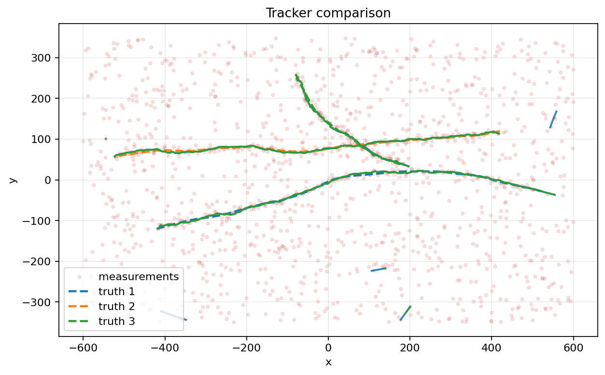
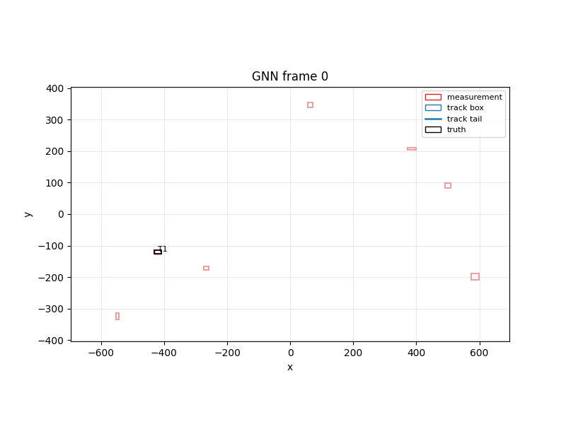
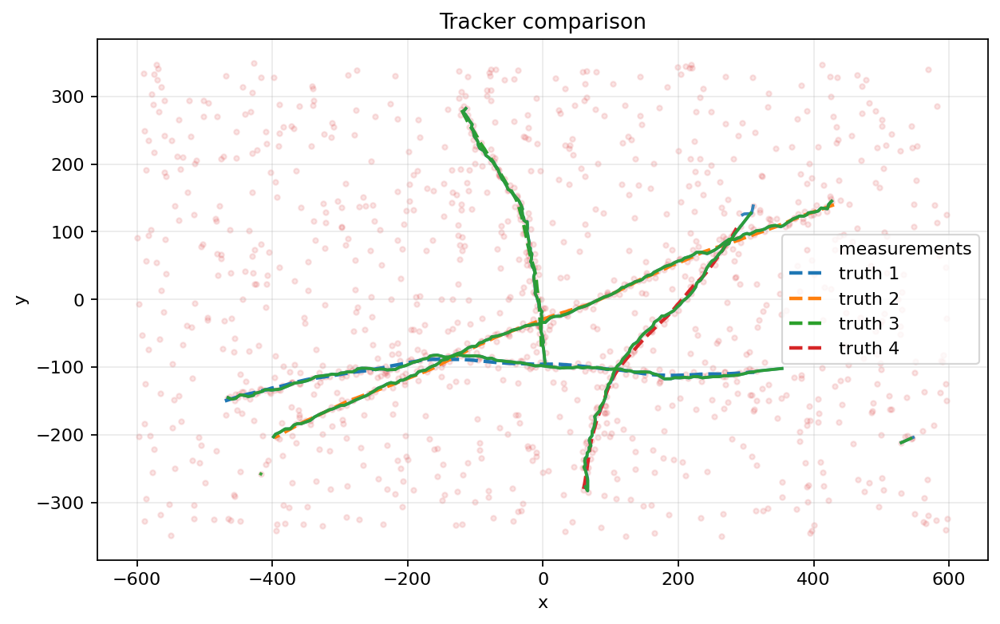
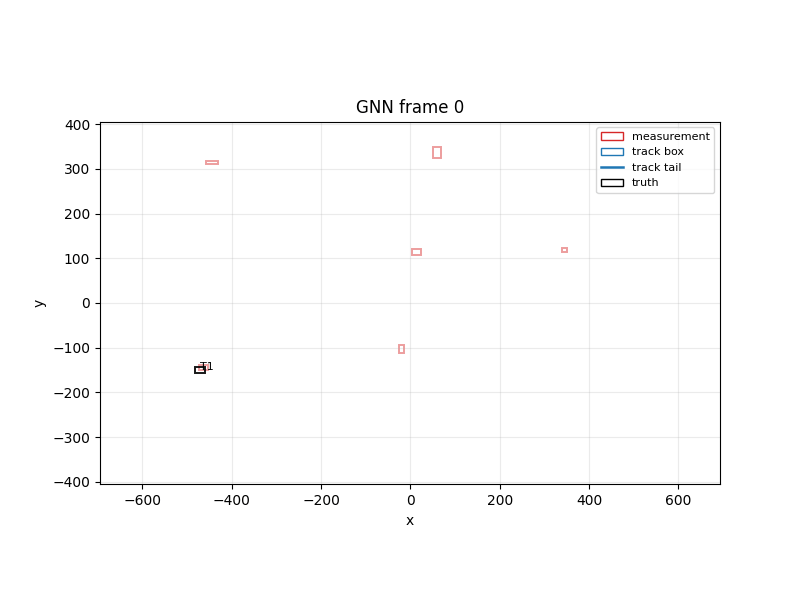
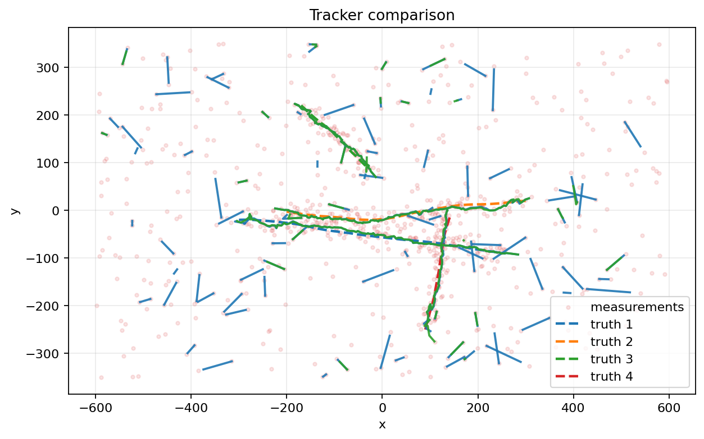
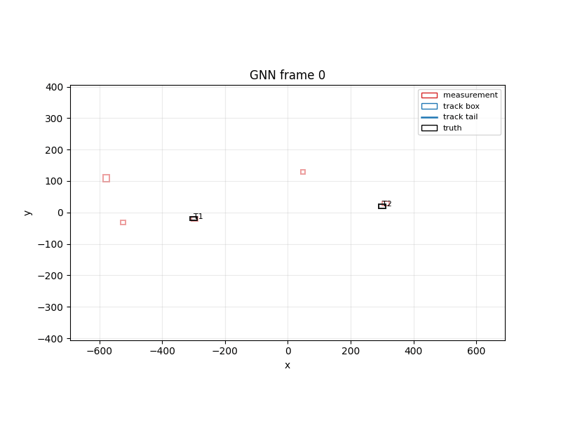
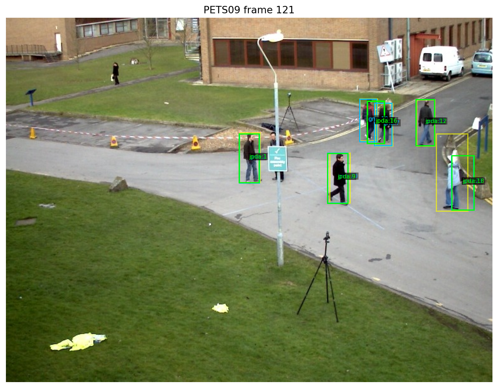

# Multi-Object Tracking in Clutter

Simple research demo for comparing two data-association trackers:

- **GNN**: Global Nearest Neighbor with gating and Hungarian assignment.
- **JPDAF**: Joint Probabilistic Data Association Filter with gated hypotheses and weighted Kalman updates.

The code is intentionally small: plain NumPy arrays, dictionary configs, Matplotlib visualization, and one CLI in `main.py`.

## Install

```bash
python -m pip install -r requirements.txt
```

Regenerate every synthetic experiment, metric file, plot, and animation:

```bash
python scripts/run_experiments.py
```

The PETS09 report outputs are included under `outputs/report/`, but the PETS09 source images/detections are not redistributed in this repo. To regenerate PETS09 results, get the data from [`apennisi/jpdaf_tracking`](https://github.com/apennisi/jpdaf_tracking/tree/master) and place:

```text
data/pets09_s2l1_detection.txt
data/pets09_s2l1/img1/
```

## Experiment Report

All report artifacts are under `outputs/report/`.

### 1. Synthetic Crossing

Three synthetic targets with staggered births and crossings. This is a moderate scenario where the association ambiguity is limited.



| Tracker | Matched / Truth | Missed | False Track Frames | ID Switches | RMSE | Mean Error |
|---|---:|---:|---:|---:|---:|---:|
| GNN | 411 / 415 | 4 | 121 | 0 | 3.76 | 3.32 |
| JPDAF | 411 / 415 | 4 | 115 | 0 | 3.74 | 3.31 |

GNN animation:



JPDAF animation:


Analysis: both trackers solve this scenario. JPDAF is slightly smoother and creates fewer false track frames, but the difference is small because the targets are usually separable.

### 2. Four Tracks With Births and Deaths

Four synthetic targets appear and disappear at different times. This tests track management more than hard association ambiguity.



| Tracker | Matched / Truth | Missed | False Track Frames | ID Switches | RMSE | Mean Error |
|---|---:|---:|---:|---:|---:|---:|
| GNN | 446 / 450 | 4 | 109 | 0 | 3.70 | 3.25 |
| JPDAF | 446 / 450 | 4 | 107 | 0 | 3.71 | 3.26 |

GNN animation:



JPDAF animation:


Analysis: GNN and JPDAF are effectively tied. This is expected: when targets do not create sustained ambiguous gates, hard assignment is enough.

### 3. JPDAF Advantage Stress Test

Four synthetic targets, including a tight noisy crossing. This scenario is designed to expose the weakness of hard one-to-one association.



| Tracker | Matched / Truth | Missed | False Track Frames | ID Switches | RMSE | Mean Error |
|---|---:|---:|---:|---:|---:|---:|
| GNN | 411 / 415 | 4 | 760 | 1 | 6.56 | 5.65 |
| JPDAF | 411 / 415 | 4 | 266 | 0 | 6.77 | 5.76 |

GNN animation:



JPDAF animation:


Analysis: JPDAF has the intended advantage here. It keeps the same detection coverage, avoids the GNN ID switch, and reduces duplicate/false track frames by about 65%. GNN has slightly lower point RMSE, but it gets that by committing to hard assignments and creating more unstable tracks.

### 4. PETS09 Visual Tracking Detections

The PETS09-S2L1 result below uses the detection file and image frames from [`apennisi/jpdaf_tracking`](https://github.com/apennisi/jpdaf_tracking/tree/master). The source PETS data is not included here; only the generated report outputs are shared. Unlike the synthetic scenarios, the PETS detection file does not include ground-truth identities, so evaluation is detection-consistency based rather than a full MOT benchmark.

PETS image overlay, frame 121:



Full PETS09 overlay video: [outputs/report/pets09_full.mp4](outputs/report/pets09_full.mp4)

<video src="outputs/report/pets09_full.mp4" controls width="720"></video>

Frame-by-frame overlay sequence: [`outputs/report/pets09_frames_100_130/`](outputs/report/pets09_frames_100_130/)

| Tracker | Coverage | Matched / Detections | Tracks | Track Frames | Unmatched Track Frames | Mean Track Length | Detection Error | Mean Acceleration |
|---|---:|---:|---:|---:|---:|---:|---:|---:|
| GNN | 0.959 | 4750 / 4953 | 66 | 5801 | 1051 | 87.9 | 2.49 | 2.71 |
| JPDAF | 0.938 | 4646 / 4953 | 50 | 5561 | 915 | 111.2 | 4.03 | 1.91 |

Analysis: GNN follows more detections and stays closer to raw boxes, so it has better coverage and lower detection error. JPDAF produces fewer tracks, fewer unmatched track frames, longer average tracks, and smoother motion. For visual human tracking this is a useful tradeoff: JPDAF is less reactive to noisy detections and clutter, while GNN is more detection-hugging.

## Commands

Run one scenario manually:

```bash
python main.py generate --scenario jpda_advantage --data outputs/jpda_advantage_scenario.npz

python main.py run --tracker gnn --data outputs/jpda_advantage_scenario.npz --result outputs/jpda_advantage_gnn.npz

python main.py run --tracker jpda --data outputs/jpda_advantage_scenario.npz --result outputs/jpda_advantage_jpda.npz

python main.py evaluate --data outputs/jpda_advantage_scenario.npz --gnn outputs/jpda_advantage_gnn.npz --jpda outputs/jpda_advantage_jpda.npz
```


Available scenarios:

```text
crossing
four
jpda_advantage
pets09
```

## Project Layout

- `mot/data.py`: synthetic scenario generation, PETS09 loader, `.npz` save/load helpers.
- `mot/kalman.py`: linear Kalman filter and JPDA weighted update.
- `mot/track.py`: candidate/confirmed/deleted track lifecycle.
- `mot/gnn.py`: GNN association baseline.
- `mot/jpda.py`: JPDAF association with component-wise hypotheses and a soft fallback for large visual scenes.
- `mot/evaluation.py`: ground-truth and detection-only evaluation.
- `mot/visualization.py`: plots, animations, and PETS09 image overlays.
- `main.py`: simple command-line entrypoint.
- `scripts/run_experiments.py`: full report regeneration.
- `docs/`: short implementation notes.
- `tests/`: focused regression tests.

## Notes

JPDAF uses exact hypothesis enumeration for small gated components. On crowded visual tracking frames, exact enumeration can become too expensive, so this implementation falls back to a simple soft marginal approximation for oversized components. This keeps the demo readable and runnable while preserving the core JPDAF behavior in small ambiguous regions.
